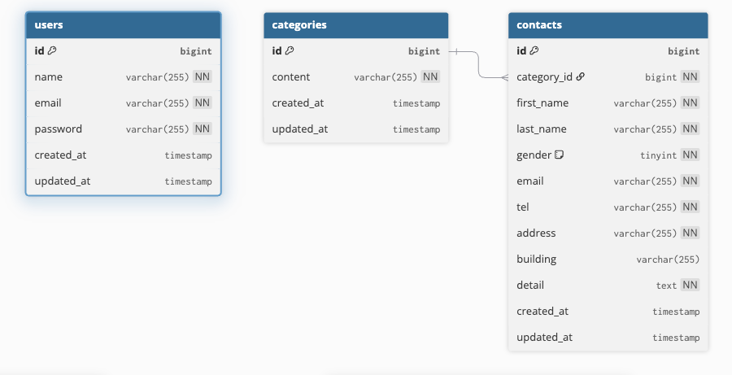

# coachtech お問い合わせフォーム

## アプリケーション概要

お問い合わせフォームから送信された内容をデータベースへ保存し、管理画面から問い合わせ内容の確認・検索・削除・CSVエクスポートを行うことができるお問い合わせ管理システムです。

---

## 使用技術

- PHP 8.2
- Laravel 10
- MySQL 8.4
- Laravel Sail
- Tailwind CSS 3.4
- Vite
- phpMyAdmin
- Docker

---

## 環境構築

### 1. リポジトリをクローン

```bash
git clone https://github.com/kei-aichi/coachtech-contact-from.git
```

### 2. プロジェクトディレクトリへ移動

```bash
cd coachtech-contact-from
```

### 3. Composer依存パッケージのインストール

```bash
docker run --rm \
    -u "$(id -u):$(id -g)" \
    -v "$(pwd):/var/www/html" \
    -w /var/www/html \
    -e COMPOSER_CACHE_DIR=/tmp/composer_cache \
    laravelsail/php82-composer:latest \
    composer install
```

### 4. .envファイルの作成

```bash
cp .env.example .env
```

### 5. .envファイルの設定

`.env`

```env
DB_CONNECTION=mysql
DB_HOST=mysql
DB_PORT=3306
DB_DATABASE=laravel
DB_USERNAME=sail
DB_PASSWORD=password
```

### 6. Sailエイリアスの設定（推奨）

毎回 `./vendor/bin/sail` と入力する代わりに、以下のエイリアスを設定します。

```bash
alias sail='sh $([ -f sail ] && echo sail || echo vendor/bin/sail)'
```

### 7. Sailの起動

```bash
sail up -d
```

### 8. アプリケーションキーの生成

```bash
sail artisan key:generate
```

### 9. マイグレーションとシーディングの実行

```bash
sail artisan migrate --seed
```

### 10. NPM依存パッケージのインストール

```bash
sail npm install
```

### 11. Vite開発サーバーの起動

新しいターミナルを開き、プロジェクトディレクトリへ移動して実行します。

```bash
sail npm run dev
```

※ 開発中は起動したままにしてください。- "${FORWARD_PHPMYADMIN_PORT:-8080}:80"
    environment:
        PMA_HOST: mysql
        PMA_USER: "${DB_USERNAME}"
PMA_PASSWORD: "${DB_PASSWORD}"
networks: - sail
depends_on: - mysql

````

追加した場合は、Sailを再起動してください。

```bash
sail down
sail up -d
````

---

## ER図



---

## URL

### 開発環境

- お問い合わせフォーム：http://localhost/
- ユーザー登録：http://localhost/register
- ログイン：http://localhost/login
- 管理画面：http://localhost/admin
- phpMyAdmin：http://localhost:8080

### phpMyAdminログイン情報

```text
ユーザー名：sail
パスワード：password
```
